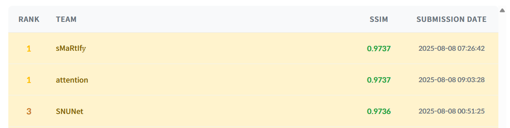
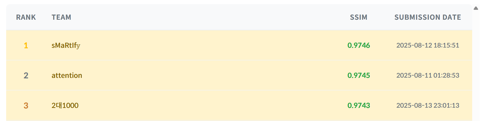
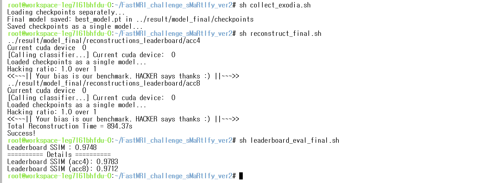
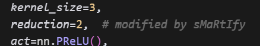
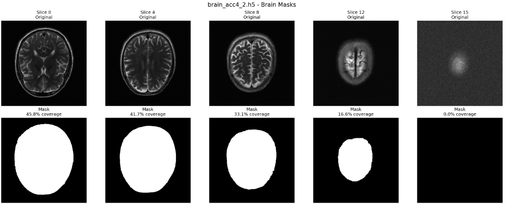
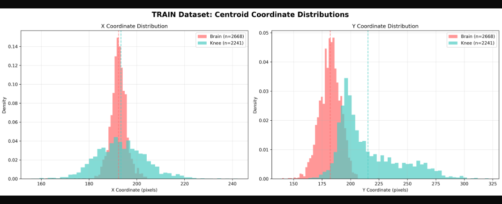
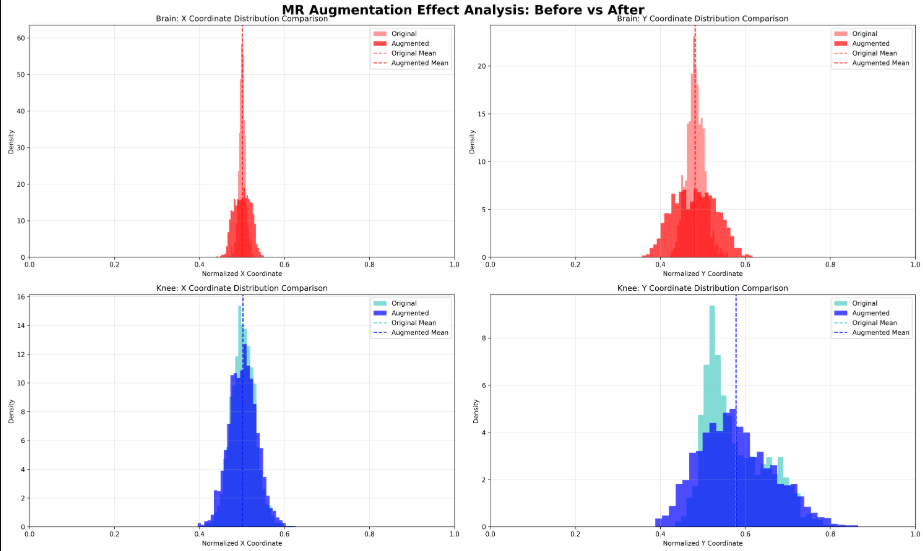

# 2025 SNU FastMRI Challenge | *Team sMaRtIfy*

English $\rightarrow$ `./README_en.md`

---


*"거인의 어깨에 올라서서 더 넓은 세상을 바라보라"* $-$ 아이작 뉴턴 

저희 팀은 세상에 알려진 소중한 정보를 적절히 모으고 저희만의 창의적인 방식으로 재결합하여, 세상에 도움이 되는 뚜렷한 성과를 내고자 합니다. 이러한 저희의 목표를 담아, 기존의 지식을 표상하는 **fastMRI**를 적절히 재배열하여 **sMaRtIf**라는 단어를 만들었고, 이러한 조합을 통해 뚜렷한 성과인 *target label*, 즉 $\textcolor{olive}{\mathbf{y}}$ 벡터를 얻어낸다는 의미로 팀명 **sMaRtIf**$\textcolor{olive}{\mathbf{y}}$를 만들었습니다.

---

#### [Seongsu Lee](https://linktr.ee/seongsulee)
* Undergrad. @ Department of Physics Education | $\tiny\textsf{Mar 2020 - Current}$
Double major in Biological Sciences, Computer Science & Engineering
* Email | dltjdtn0727@snu.ac.kr

#### Woojin Lee
* Undergrad. @ Department of Materials Science and Engineering | $\tiny\textsf{Mar 2021 - Current}$
Double major in Electrical & Computer Engineering
* Email | eugene5759@snu.ac.kr

---

## 1. 대회 개요

본 대회는 [서울대학교 전기정보공학부](https://ece.snu.ac.kr/)의 [LIST](https://list.snu.ac.kr/) 연구실이 주관하고 [AIRS Medical](https://airsmed.com/)이 후원하는 대회로, NYU의 [FastMRI dataset](https://fastmri.med.nyu.edu/)과 Facebook AI 및 NeurIPS의 [FASTMRI Challenge](https://github.com/facebookresearch/fastMRI?tab=readme-ov-file)를 기반으로 합니다.

MRI(Magnetic Resonance Imaging)는 자기장을 이용하여 인체 내부 구조를 비침습적으로 촬영하는 기술입니다. 신속한 촬영을 위해 k-space를 부분 샘플링하면 정보 손실로 인해 이미지 화질이 저하되는데, 이를 고품질 영상으로 복원하는 알고리즘을 설계하는 것이 본 대회의 핵심 과제입니다.

#### [2025 제 5회 SNU FastMRI Challenge 상세](https://fastmri.snu.ac.kr/)
* 학부생 1-2인 1팀
* 대회 기간: 2025년 7월 1일 - 8월 20일
* 상금 규모: 2,000만원(1등 1,000만원)
* 참여 인원: 235명(154팀, 등록 마감 전날 기준)
* 사용 환경: NVIDIA GTX 1080, 8GB VRAM 제한 ([VESSL AI](https://vessl.ai/ko) 제공)
* Inference time 제한: 3,600초
* Dataset (NYU FastMRI dataset의 재가공된 데이터)
    * 뇌/무릎 MRI 영상, multi-coiled k-space & image data
    * 가속: X4, X8 (공개 데이터는 모두 등간격)
    * 학습용 데이터 크기
        * 부위-가속 쌍 각각에 대해 85개의 train data, 15개의 validation data
* 사전 학습된 모델 가중치 또는 외부 데이터 사용 불가

---

## 2. Team sMaRtIfy - 성과

#### (1) 중간평가 1위 | SSIM = 0.9737 @ 17:00, Aug 8



#### (2) 공개 리더보드 1위 | SSIM = 0.9746 @ 0:00, Aug 14



#### (3) 최종 제출 | SSIM = 0.9748 @ 23:59, Aug 20



#### (4) 최종 순위 ❓위 | 비공개 리더보드 SSIM = 0.XXXX

---

## 3. 모델 구조 및 학습 전략

#### 🤖 Backbone: PromptMR+

저희의 모델은 [Xin et al.의 PromptMR+](https://link.springer.com/chapter/10.1007/978-3-031-73226-3_10) 구조를 따릅니다. 논문에 따르면 PromptMR+는 각종 데이터셋에서 SOTA에 해당하는 평가 결과를 얻어냈습니다. PromptMR+가 기존의 모델과 다른 점은 다음의 세 가지입니다.

1. **자기-적응적(Self-Adaptive) 그래디언트 학습**
    - MRI 영상 내 영역별 난이도가 다름 → 픽셀 단위로 학습률을 조절
    - 배경처럼 단순한 영역은 큰 변화, 복잡한 구조는 미세 조정
    - CNN 기반 확장으로 안정성 및 학습 표현력 강화

2. **모멘텀 가속(Momentum-Accelerated) 기법**
    - 반복 단계마다 특징 맵을 모아(concatenate) 전달 → RNN처럼 “기억” 기능 수행
    - Channel Attention Block으로 중요한 정보만 강화
    - 반복 간 정보 손실을 막고 수렴 속도 개선

3. 메모리 효율적 인접 정보 기반 민감도 맵(Sensitivity Map) 추정
    - 다중 코일 MRI에서는 코일별 민감도 맵이 필요
    - 기존엔 코일별/슬라이스별로 따로 계산해 메모리 부담 큼
    - 본 연구는 인접 슬라이스 정보 공유를 활용해 연산 횟수를 크게 줄이고 정확도 향상
    - 결과: 메모리 사용량 약 55% 절감

이 중 team sMaRtIfy가 본 challenge에서 활용한 알고리즘으로는 1번과 2번이 있으며, 3번의 경우 구현상의 복잡함 및 추가 메모리 사용량 문제로 활용하지 않았습니다.

학습 기본 설정은 다음과 같습니다.
- Cascade 수: 8개 (원 저자는 12)
- 3단 prompt block, channel attention (CA) 모듈 포함
- `adaptive_input=True`, `n_buffer=4`, `n_history=3`을 통해 잔차/history feature를 유연하게 결합
- 최종 출력은 `384×384`로 center crop

#### 👛 GPU VRAM 절약 전략

- 체크포인팅: `--use-checkpoint True`로 활성화 (기본값 True)
    - _**Reentrant Wrapper**_
        ```python
        class ReentrantWrapper(nn.Module):

            DEFAULT_CHECKPOINT = True
            
            class _DummyWrapper(nn.Module):
                def __init__(self, module):
                    super().__init__()
                    self.module = module
            
                def forward(self, *args):
                    x, dummy = args[:-1], args[-1]
                    return self.module(*x)
                    
            def __init__(
                self, 
                module: nn.Module, 
                use_checkpoint: Optional[bool] = None
            ):
                super().__init__()
                
                self.use_checkpoint = use_checkpoint or self.DEFAULT_CHECKPOINT
                self._dummy_tensor = nn.Parameter(torch.ones(1, requires_grad=True))
                
                self.module = self._DummyWrapper(module)
            
            def forward(self, *args):
                if self.use_checkpoint and self.training:
                    return checkpoint(self.module, *args, self._dummy_tensor, use_reentrant=True)
                else:
                    return self.module(*args, self._dummy_tensor)
        ```
        VRAM 사용량을 획기적으로 줄여주는 reentrant checkpointing이 입력 중 gradient 연산을 허용하는 텐서가 있어야 함을 이용 
        
        → `dummy` 텐서를 함께 입력해 자동으로 reentrant checkpointing 활성화
        → 메모리 사용량이 많은 `sens_map`에 적용

- 모델 크기 축소
    - 원본 PromptMR+ 대비 채널 수를 낮춰 8GB VRAM 제약 대응
    - 파라미터 수를 *하나만 늘려도* CUDA out of memory가 발생하는 수준으로 크게 설정
        ```python
        # --- MODEL HYPERPARAMETERS -------------------------------------------------------------------------------------------
        parser.add_argument('--num-cascades', type=int, default=8, help='Number of cascades | 12 in original PromptMR+')
        parser.add_argument('--n-feat0', type=int, default=8, help='Number of feat0 | 48 in original PromptMR+')
        parser.add_argument('--feature-dim', type=List[int], default=[24, 32, 40], help='Sizes of feature dimension | [72, 96, 120] in original PromptMR+')
        parser.add_argument('--prompt-dim', type=List[int], default=[8, 16, 24], help='Sizes of prompt dimension | [24, 48, 72] in original PromptMR+')
        parser.add_argument('--sens-n-feat0', type=int, default=8, help='Number of feat0 for sensitivity map | 24 in original PromptMR+')
        parser.add_argument('--sens-feature-dim', type=List[int], default=[12, 16, 20], help='Sizes of sensitivity feature dimension | [36, 48, 60] in original PromptMR+')
        parser.add_argument('--sens-prompt-dim', type=List[int], default=[4, 8, 12], help='Sizes of sensitivity-prompt dimension | [12, 24, 36] in original PromptMR+')
        parser.add_argument('--len-prompt', type=List[int], default=[3, 3, 3], help='Length of prompt vectors per level | [3, 3, 3] in original PromptMR+')
        parser.add_argument('--prompt-size', type=List[int], default=[16, 8, 4], help='Spatial size of prompt per level | [64, 32, 16] in original PromptMR+')
        parser.add_argument('--n-enc-cab', type=List[int], default=[2, 3, 3], help='Number of CABs in encoder blocks | [2, 3, 3] in original PromptMR+')
        parser.add_argument('--n-dec-cab', type=List[int], default=[2, 2, 3], help='Number of CABs in decoder blocks | [2, 2, 3] in original PromptMR+')
        parser.add_argument('--n-skip-cab', type=List[int], default=[1, 1, 1], help='Number of CABs in skip connections | [1, 1, 1] in original PromptMR+')
        parser.add_argument('--n-bottleneck-cab', type=int, default=3, help='Number of CABs in bottleneck block | 3 in original PromptMR+')
        parser.add_argument('--no-use-ca', type=bool, default=False, help='Disable channel attention module in CABs | False in original PromptMR+')

        # Plus implementations
        parser.add_argument('--adaptive-input', type=bool, default=True, help='Use residual adaptive input in Unet encoder | True in PromptMR+')
        parser.add_argument('--n-buffer', type=int, default=4, help='Number of internal feature buffers in PromptMRBlock | 4 in original PromptMR+')
        parser.add_argument('--n-history', type=int, default=3, help='Duration of history consideration | 11 in PromptMR+')
        parser.add_argument('--use-sens-adj', type=bool, default=True, help='Use adjacent slices when estimating sensitivity map | True in PromptMR+')
        # =====================================================================================================================
        ```
    - 코드 내부 `reduction` 파라미터 변경 **(16 → 2)**
    : 메모리 사용량을 최소한으로 늘리면서 `feat_0`의 큰 감소폭에 따른 표현력 약화를 완화
        

- `sens_map` 추정 시 per-coil 연산 옵션으로 최대 메모리 제어(원본 코드에서 지원)

#### 😈 *Hacker-Helper 전략*

- `Hacker`: 공개 데이터에서 확인되는 등간격 k-space mask 패턴에 최적화된 단일 전문가.
    - `'./FastMRI_challenge_sMaRtIfy_ver2/experiments/fastmri mask types.xlsx'` 참조
    - 공개된 모든 데이터의 k-space mask는 다음의 규칙을 따라 만들어짐을 발견함
        ```python
        start_idx = (width // 2) % acc
        ```
        - 성수🗣️ *"Overfitting을 유도하기 위해 줄무늬의 위치를 고정했을 것이다"*
        - 우진🗣️ *"깊게 생각하지 않았거나, 생각없이 mask augment한 팀을 저격했을 것이다"*
    - 두 경우의 수 모두에 대응할 수 있도록 모델을 두 가지로 설계
    → **Hacker: 의도적으로 공개된 데이터의 패턴에 오버피팅**
- `Helper`: 비공개 리더보드에서의 mask 분포 변화에 강건하도록 k-space mask 증강을 적용.
    - 무작위 `start_idx`를 통해 만든 등간격 mask 50%
    - 완전히 무작위로 추출하여 만들어지는 mask 50% 
- 두 계열 모두 동일한 모델을 사용하여 mask 증강을 제외한 모든 단계에서 동일하게 학습
- 추론 단계에서는 `Broker()` 모듈을 통해 hacked mask인지 구별하여 둘 중 한 모델에 전달
- Leaderboard 평가 결과
    - Hacker: SSIM = **0.9748**
    - Helper: SSIM = **0.9746** (- 0.0002 + robustness)

#### 🧪 Validation Data 활용

- `--use-val-for-final` 입력을 통해 validation data를 학습에 사용할지 결정 가능
    - 제출용 모델에서는 `use_val_for_final = True`로 설정하여 일반화 성능 향상
    - 타 서버에서 동일 코드를 `use_val_for_final = False`로 실행하여 에폭별 일반화 성능 측정
        - 일반화 성능이 포화되어 과적합이 시작되는 30에폭부터 MRAugment 적용 계획
        - `'./FastMRI_challenge_sMaRtIfy_ver2/experiments/terminal_log/'`의 `'[external] hacker_baseline_val.txt'` 참고
        - 이를 무시하고 45에폭에서 MRAugment 적용시 최종 SSIM이 감소함을 확인(**0.9743**)

#### 📉 Loss 설계

- 기본 함수: SSIMLoss (`utils/common/loss_function.py`)
- 추가 함수: `--regularizer-loss {L1|L2}`로 보조 평가를 에폭 기준으로 활성 가능
    - 본 대회에서는 사용하지 않음
- 마스크 가중치
    - 이미지 마스크(`gamyun`)로 무효 영역을 가림 (빠른 수렴 및 동일 조건에서 **+0.0004** 확인)
        - 가릴 영역의 세기 설정 가능(본 대회에서는 0 적용)
    - 남아있는 면적 비율에 비례한 스칼라 가중치(√area - 넓은 이미지일수록 더 많은 특징이 있을 것으로 추론)를 적용 (동일 조건에서 **+0.0008** 확인)
        
    - 두 방법 모두 0에폭부터 적용

#### 👯‍♀️ Mixture of Experts (MoE)

- 전문가 4개: {brain×acc4, brain×acc8, knee×acc4, knee×acc8}
- 분기 방식: 분류기 출력(`class_label`)을 사용하여 해당 전문가 경로로 복원 수행
    - 학습 시에는 `'dummy'` 분류기를 사용하여 파일명으로 구분
    - 추론 시에는 ResNet 구조인 `'awesome_classifier_ver2.pt'` 이용
- 추정 효과: **+0.0002**

    ##### 🔀 Brain-Knee Classifier 구현

    - ResNet50 사용
    - 제공되는 Grappa image를 입력으로 사용하여 dataloader에서 미리 파일별로 분류
    - `nn.BatchNorm()` 및 `batch_size = 16` 적용 → 안정적 학습
    - 추가적인 Lasso loss 항 추가 → 일반화 성능 향상
    - `CosineAnnealingLR()` 사용 → local minima를 여러 번 벗어나게 설계
    - Validation set으로 훈련, train set으로 검증 → 100에폭 중 val loss가 가장 낮은 모델 선택
        - Train set의 4937개 slice 중 1개 오분류 → 파일 수준 배치처리에서는 무시됨
        - 재현성은 `./FastMRI_challenge_sMaRtIfy_ver2/experiments/terminal_log/`의 `[IABENG41] awesome_classifier_ver2.txt` 참고

#### 🫥 Augmentation: MRAugment 및 K-Space Mask 증강

- MRAugment: 기하적 변환 기반의 증강을 스케줄링(`exp`)하며, brain/knee 각각의 분포를 관찰하여 다른 파라미터를 사용(MoE 단계부터 적용)
    
    ```python
    # Brain augmentation
    parser.add_argument('--brain-aug-delay', type=int, default=3) # Starting epoch is added later
    parser.add_argument('--brain-aug-strength', type=float, default=0.5)
    parser.add_argument('--brain-aug-weight-translation', type=float, default=1.)
    parser.add_argument('--brain-aug-weight-rotation', type=float, default=1.)
    parser.add_argument('--brain-aug-weight-shearing', type=float, default=1.)
    parser.add_argument('--brain-aug-weight-scaling', type=float, default=1.)
    parser.add_argument('--brain-aug-weight-rot90', type=float, default=0.)
    parser.add_argument('--brain-aug-weight-fliph', type=float, default=0.4) # Considering asymmetry of Wernicke's area
    parser.add_argument('--brain-aug-weight-flipv', type=float, default=0.)
    parser.add_argument('--brain-aug-max-translation-x', type=float, default=0.03)
    parser.add_argument('--brain-aug-max-translation-y', type=float, default=0.05)
    parser.add_argument('--brain-aug-max-rotation', type=float, default=5.)
    parser.add_argument('--brain-aug-max-shearing-x', type=float, default=5.)
    parser.add_argument('--brain-aug-max-shearing-y', type=float, default=5.)
    parser.add_argument('--brain-aug-max-scaling', type=float, default=0.12)

    # Knee augmentation
    parser.add_argument('--knee-aug-delay', type=int, default=3) # Starting epoch is added later
    parser.add_argument('--knee-aug-strength', type=float, default=0.5)
    parser.add_argument('--knee-aug-weight-translation', type=float, default=1.)
    parser.add_argument('--knee-aug-weight-rotation', type=float, default=1.)
    parser.add_argument('--knee-aug-weight-shearing', type=float, default=1.)
    parser.add_argument('--knee-aug-weight-scaling', type=float, default=1.)
    parser.add_argument('--knee-aug-weight-rot90', type=float, default=0.)
    parser.add_argument('--knee-aug-weight-fliph', type=float, default=0.5)
    parser.add_argument('--knee-aug-weight-flipv', type=float, default=0.)
    parser.add_argument('--knee-aug-max-translation-x', type=float, default=0.08)
    parser.add_argument('--knee-aug-max-translation-y', type=float, default=0.08)
    parser.add_argument('--knee-aug-max-rotation', type=float, default=5.)
    parser.add_argument('--knee-aug-max-shearing-x', type=float, default=10.)
    parser.add_argument('--knee-aug-max-shearing-y', type=float, default=10.)
    parser.add_argument('--knee-aug-max-scaling', type=float, default=0.12)
    ```
    - 분포의 형태가 변하지 않는 선에서 최대한 extrapolate되도록 증강 강도 설정
        
    - Brain의 경우 Wernicke 영역의 좌우 비대칭성을 고려하여 좌우대칭 확률 40%로 설정
    - Scheduling: 33에폭부터 지수적 증가, 50에폭에 증강 확률 50% 적용하여 유지
    - 추정 효과: **+0.0009**
- K-space 마스크 증강: Helper 훈련에서 적용하여 비공개 데이터의 분포 변화에 대한 강건성 확보
    - 0-15에폭: 증강 x
    - 16-25에폭: 증강 확률 0% → 100% 지수적 증가
    - 26-29에폭: 증강 확률 100%로 유지
    - 30-59에폭: 증강 확률 100%, **hacked mask는 제외하고 다시 추출**

#### 🗓️ Learning Rate Scheduling

- Baseline: `StepLR` + `--scheduler-start-epoch`
    - `lr=2e-4`로 시작, 16에폭과 27에폭에서 각각 0.3배
- MoE: `LinearLR` → `ConstantLR` → `StepLR`의 순차 스케줄
    - 30-32에폭 `LinearLR`: MoE에 따른 데이터 분포 급변 완화
    - 33-38에폭 `ConstantLR`: MRAugment 증강 데이터의 특징 집중 학습
    - 39-59에폭 `StepLR`: MRAugment 포화 이후 고차원적 특징 학습

---

## 4. 재현 가이드

본 모델의 재현 방식은 버전에 따라 두 가지로 나뉩니다. 구체적인 실험 방식은 ```./FastMRI_challenge_sMaRtIfy_ver2/README.md``` 또는 ```./FastMRI_challenge_sMaRtIfy_final/README.md```를 참고하세요. 

⚠️ 한 서버에서 실험할 경우 전체 재현 시간이 **26일**에 달하니 hacker와 helper는 따로 훈련해주세요.

* ```./FastMRI_challenge_sMaRtIfy_ver2/``` : 모델의 실제 훈련 과정과 동일한 코드를 사용한 버전입니다. **최대한의 재현성에 초점을 두는 경우 사용을 권장**하나, 대회 권장 사항을 모두 지켰음에도 매 iter에서의 0.000X 단위 loss 재현은 되지 않으니 참고하여 실행해주세요. 대부분의 random seed는 고정되었음을 해당 버전의 ```./experiments/terminal_log/```에 위치한 ```[iabeng71] randomness_reproducibility_5epoch.txt```에서 비교대조하여 확인할 수 있습니다.
        

* ```./FastMRI_challenge_sMaRtIfy_final/``` : 제출용 모델과 동일한 알고리즘을 상대적으로 간결한 명령으로 실행할 수 있습니다. 코드 또한 거의 동일하나, 버전 2에서 재현되는 수준으로는 seed가 고정되지 않습니다. 모델 및 학습 알고리즘의 이해를 위한 버전이기도 합니다.

    주요한 차이를 일으키는 코드(helper)는 공개 리더보드 점수와 무관하므로, 어느 정도는 본 버전을 사용하여 재현해도 무방합니다.

#### 시드 고정 전략

* torch/numpy/random 전역 시드 고정
    `utils/common/utils.py::seed_fix`
* 증강 파이프라인 시드 별도 고정
    `DataAugmentor.seed_pipeline(seed+2000)`
* K-space mask 증강 시 시드 별도 고정
    `self.rng = np.random.RandomState(seed + 1000 if seed is not None else None)`
* Checkpoints 재개 시 optimizer/scheduler 상태 복원 옵션 제공

---

## 5. References

[[1](https://link.springer.com/chapter/10.1007/978-3-031-73226-3_10)] Xin, B., Ye, M., Axel, L. and Metaxas, D.N., 2024, September. Rethinking deep unrolled model for accelerated MRI reconstruction. In European Conference on Computer Vision (pp. 164-181). Cham: Springer Nature Switzerland.

[[2](https://arxiv.org/abs/2106.14947)] Fabian, Z., Heckel, R. and Soltanolkotabi, M., 2021, July. Data augmentation for deep learning based accelerated MRI reconstruction with limited data. In International Conference on Machine Learning (pp. 3057-3067). PMLR.